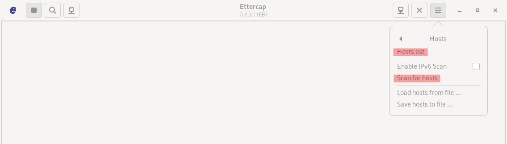
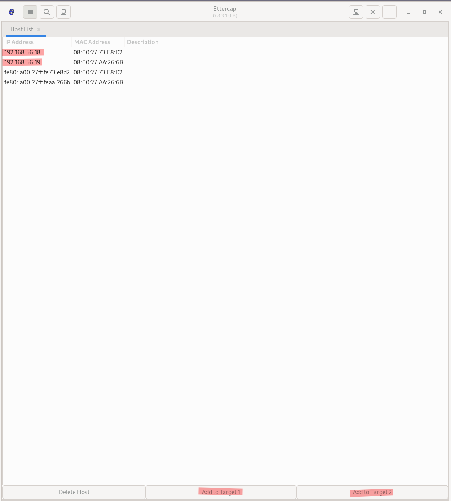
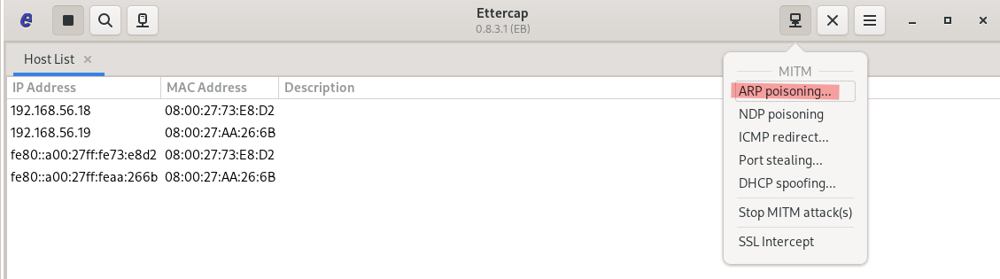
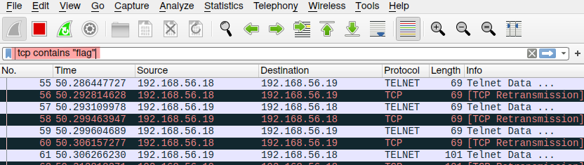

# Toxic Network

## Preparations

- scan the network for machines "nmap <NETWORK-IP>/24"
	-> 2 systems should be up and running

- install ettercap and wireshark for a mitm attack and packet sniffing

- Be sure to chose the interface for the network your targets are located in with both tools 
	-> normally something like vboxnet0 for a private network

## Get the flag

Thanks to our scan we see that port 23 for telnet is open on one of our targets.
The challenge tells us to have a look at the traffic. (Telnet sends unencrypted packets over the network!)

In order to get access to the packets between our targets we start a Man-in-the-Middle attack with ARP-Poisoning. 
In **ettercap** we can scan for hosts in the network and view them afterwards in the "Hosts list".

Scan and go into the hosts list view.

From there we can add our targets to Target 1 and 2.
Click on a list entry and afterwards on "Add to target".

After setting the targets we can start the ARP poisoning attack from the "MITM menu".

Next step is to start **Wireshark** to have a look at network packets.
The telnet traffic is sent every minute.
We can filter for the IP-adresses of the machines.

Because telnet is unencrypted and we know we search for a flag, another good filter to try is searching the content of the packet for the flag keyword. 

With "right click > as Printable text" we can select the flag string from the Hex View.
